# Calendar API: Visual Documentation

Mermaid diagrams illustrating Calendar API concepts, capabilities, and workflows.

## API Capabilities Mindmap

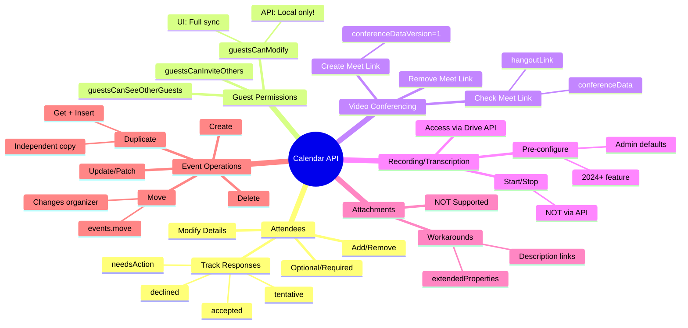

## Feature Support Status

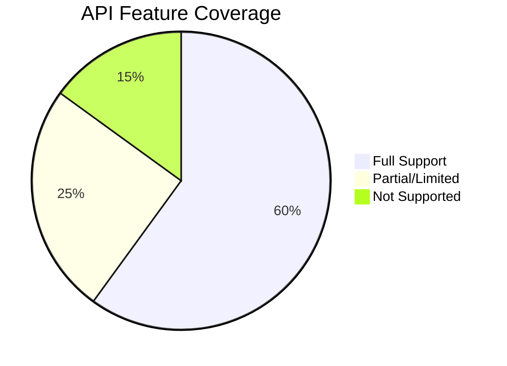

## Event ID Relationships

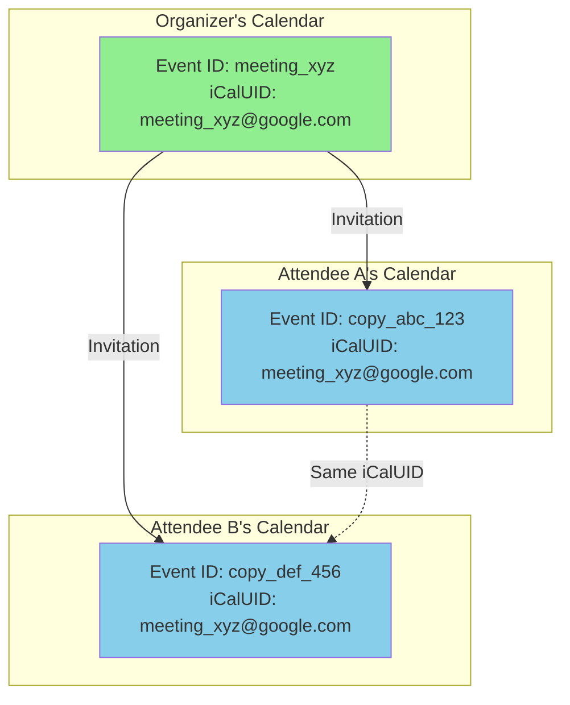

## Shared Calendar vs Invitation

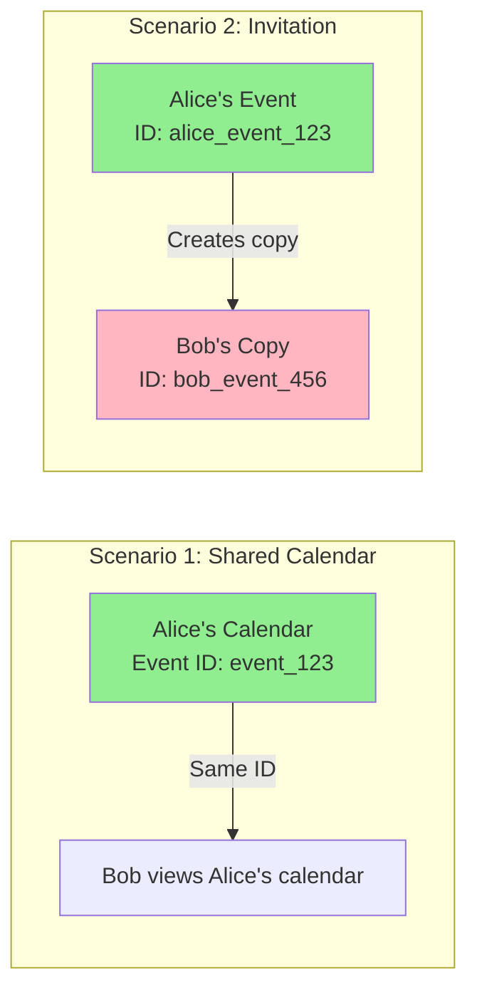

## Move vs Duplicate Operations

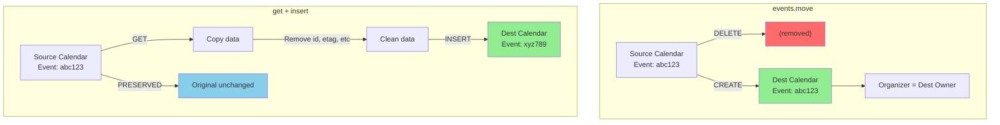

## Guest Modification Gotcha

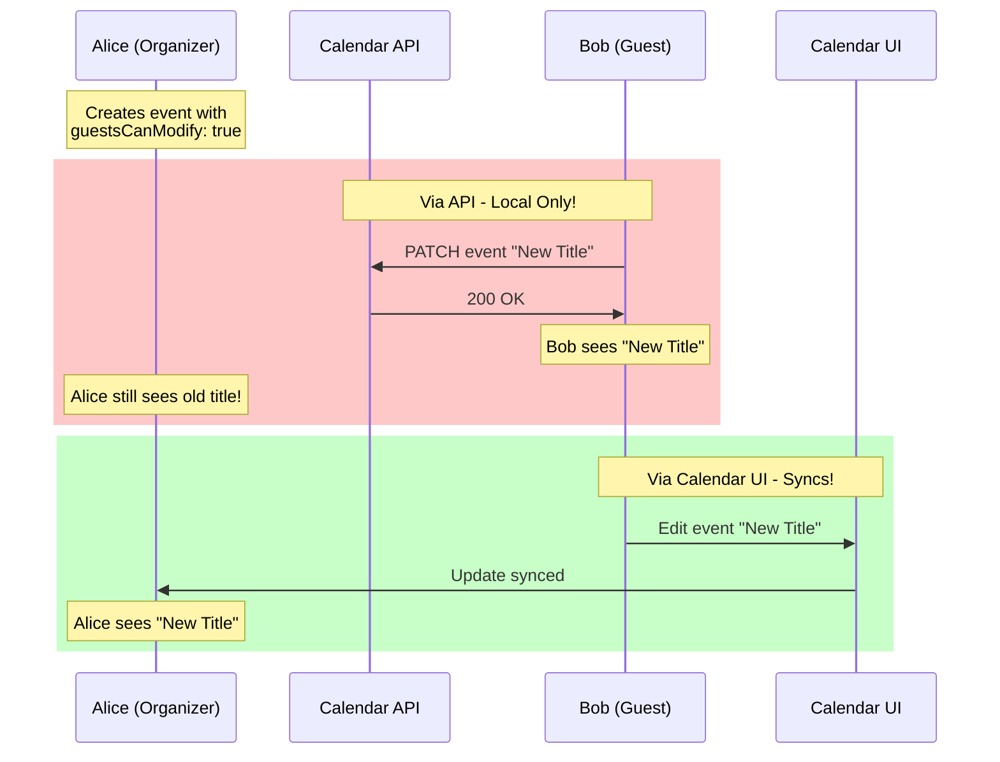

## Recurring Event Structure

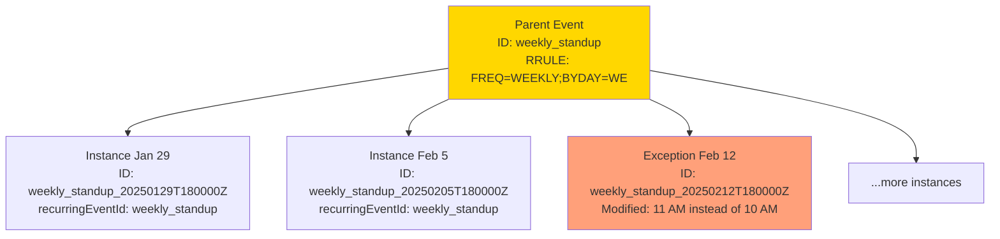

## Conference Data Flow

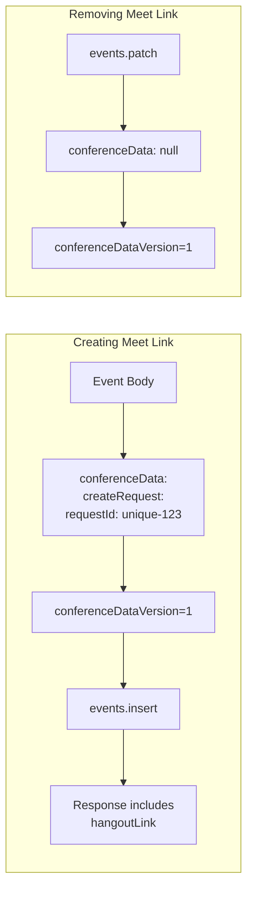

## All-Day Event Date Math

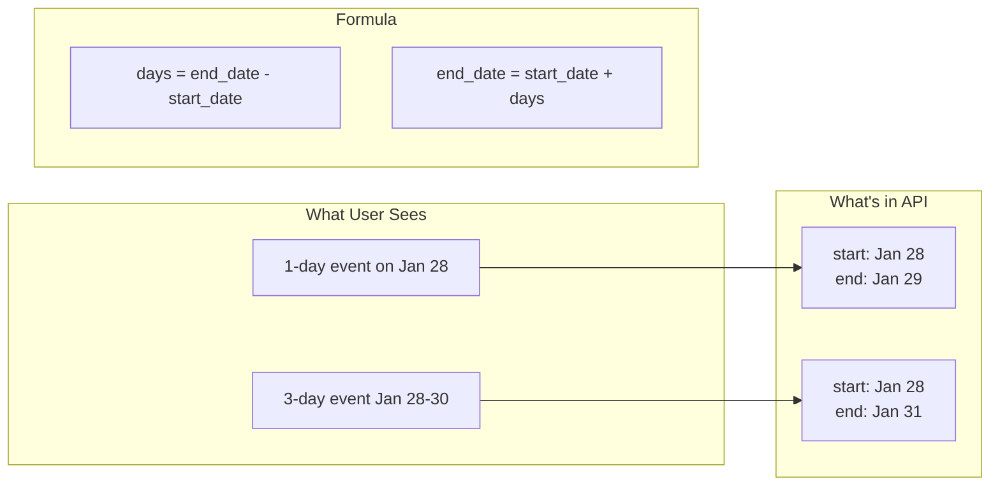

## Event Types and Operations

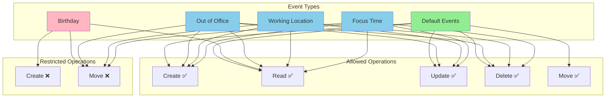

## Calendar vs CalendarList

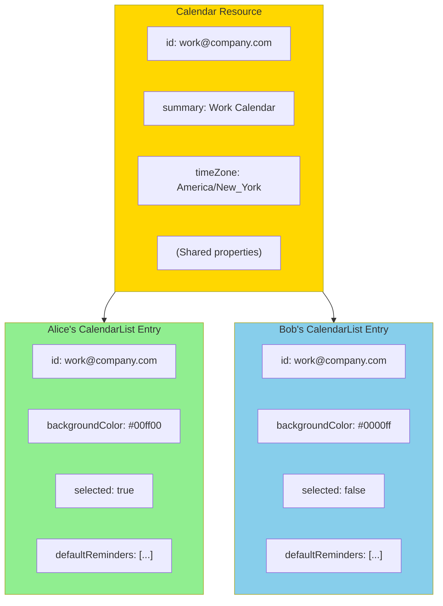

## Recording/Transcription Availability

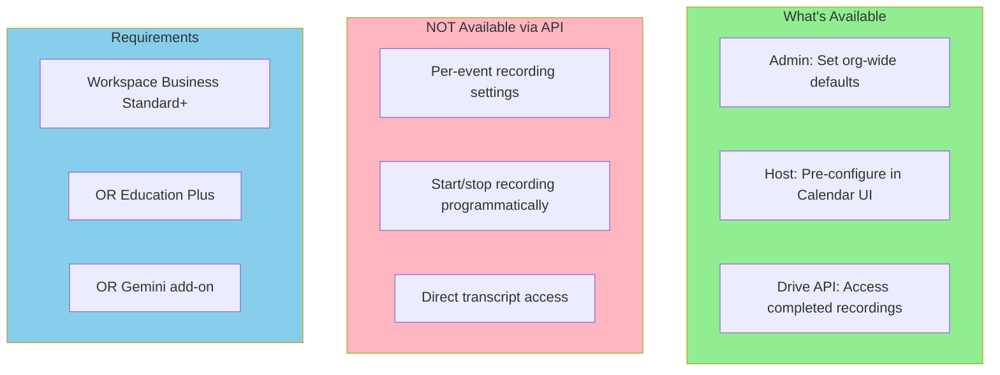

---

## See Also

* `api-capabilities.md` - Detailed feature documentation
* `ux-to-data-mapping.md` - UI to API mapping
* `identifiers.md` - ID semantics
