# Gmail API: Visual Documentation

Mermaid diagrams illustrating Gmail API concepts, label mechanics, and workflows.

## Label System Overview

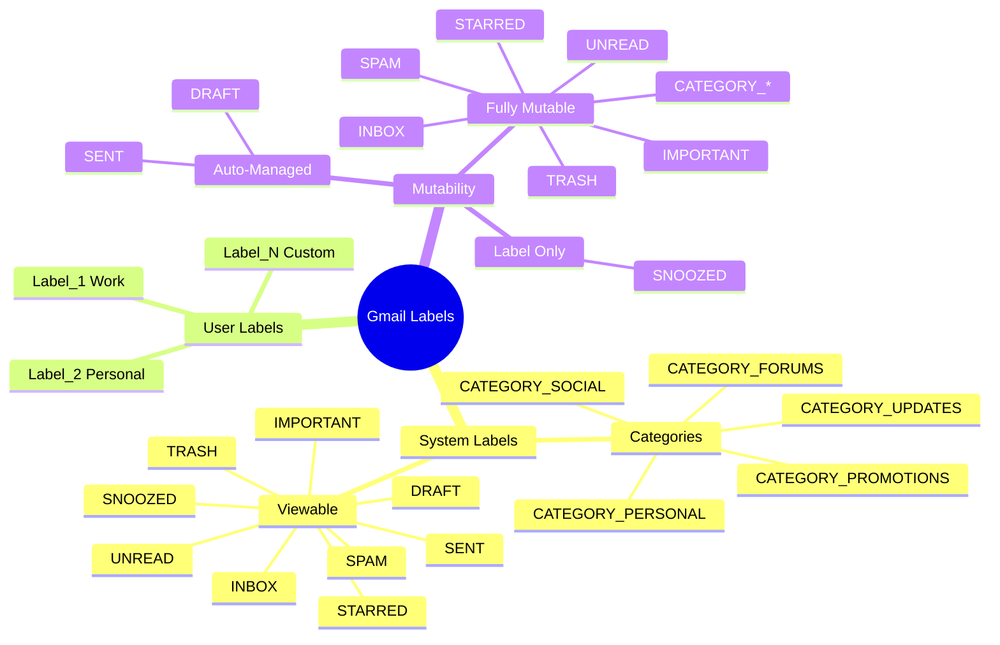

## Message Location via Labels

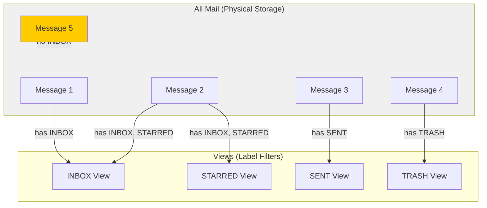

## Archive Operation

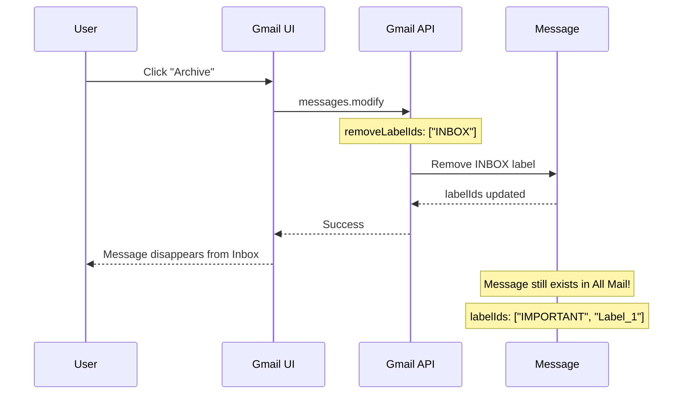

## Trash Operation

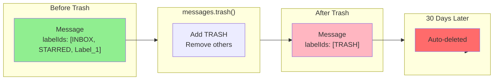

## System Label Mutability

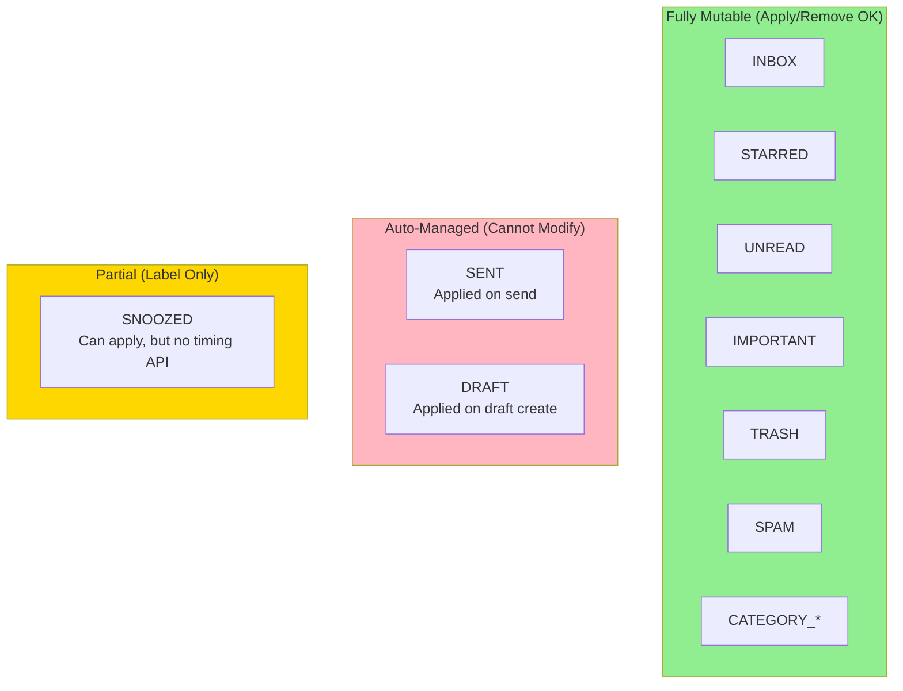

## Draft as Thread Reply

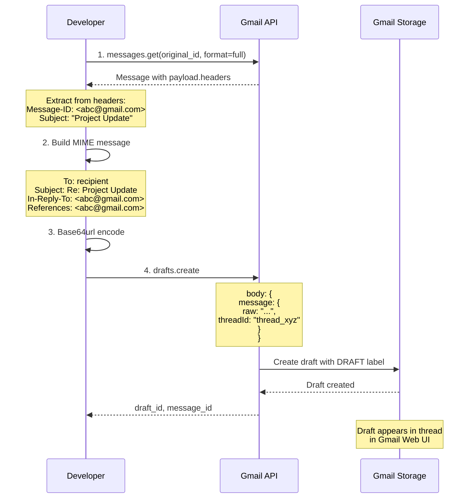

## Message-ID vs Gmail ID

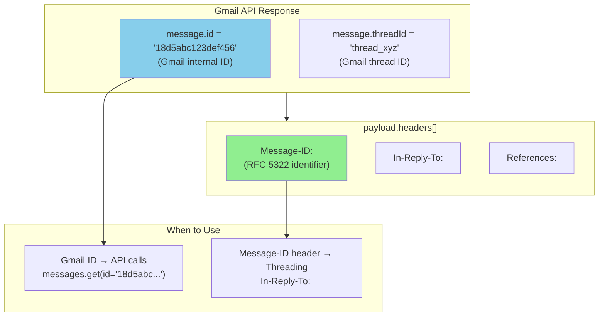

## Thread ID Is User-Specific

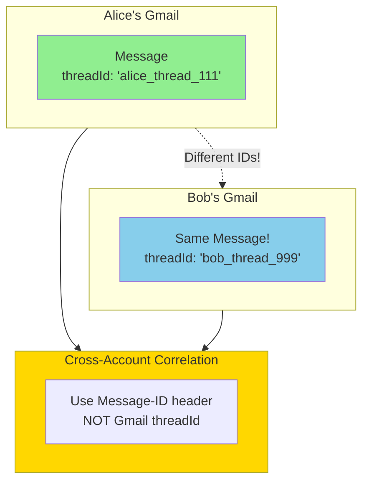

## Label Rename: ID Persists

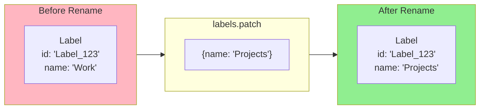

## Categories Tab System

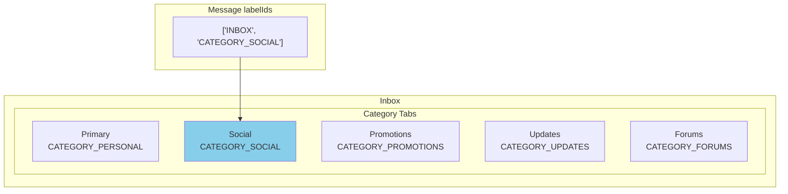

## Draft Lifecycle

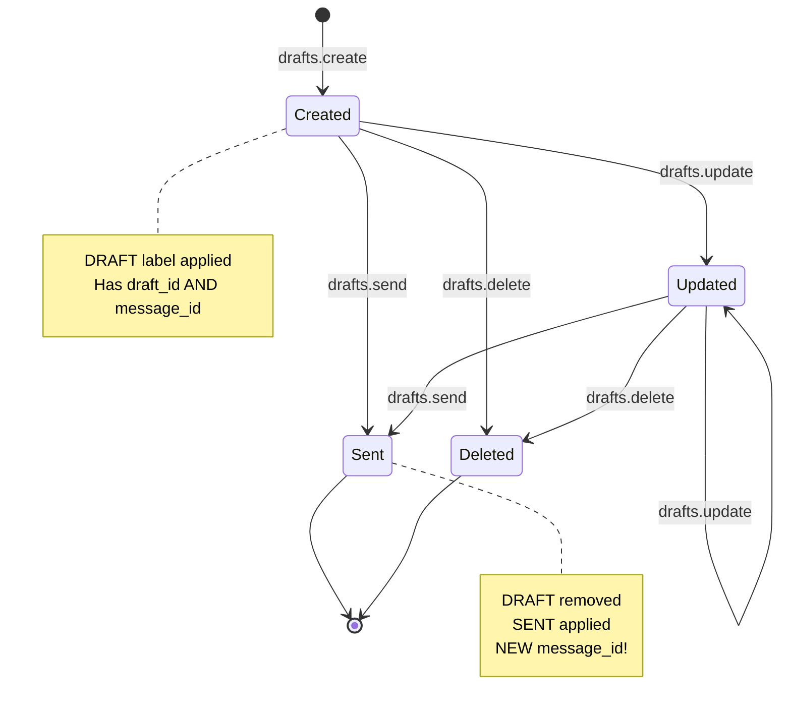

---

## See Also

* `api-capabilities.md` - Detailed feature documentation
* `ux-to-data-mapping.md` - UI to API mapping
* `identifiers.md` - ID semantics
